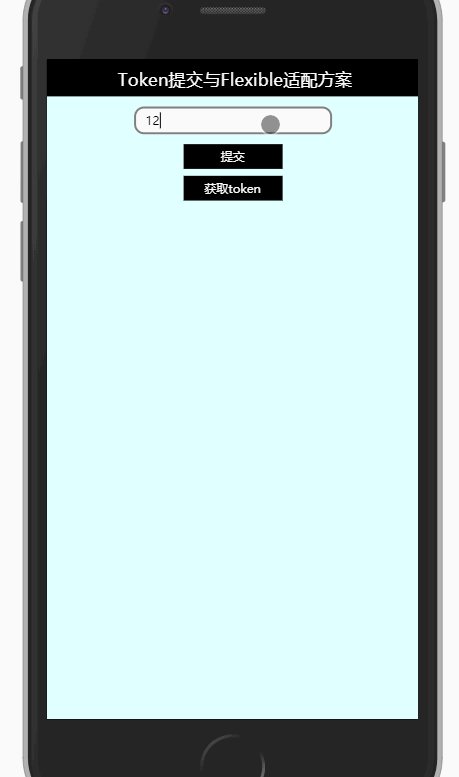

# vue-login

> 登录管理及移动适配方案

## 介绍

1. 此项目利用 Github token 来进行登录和获取数据

2. router.forEach 的作用是在路由跳转之前检查目的路由是否需要验证，以及检查本地状态是否存在路由 -> 管理路由状态

3. axios.interceptors 的作用是在请求发送前给头信息添加token，以及返回响应错误时进行处理 -> 管理请求响应状态

#### 2018-1-19 更新  

1. 使用手淘lib-flexible移动适配方案进行开发。方案原理简单来说就是引入一个库，这个库可以根据移动端的dpr和屏幕大小，动态设置一个根data-dpr属性和font-size，之后根据设计稿大小，将设计稿内容从px转为rem来实现自适应。如何转换单位？比如我们有一个设计图，大小为750px，根据flexible的定义，px转rem的基础值为750 / 10 = 75，即75px = 1rem，在项目编写中，可以运用cssrem插件进行转换。

2. 根据方案实现后，我们会发现页面中的所有内容都会自适应，包括文字，尤其是在高dpr中。比如dpr=1下文字大小为24px，但在dpr=2的设备中文字大小就剩下12px了，因为分辨率翻了一倍让文字变小了。所以为了防止文字变小，我们需要根据dpr大小对文字设置不同的值，这里使用scss设置了一个宏来进行转换。
``` scss
@mixin font-dpr($font-size){
    font-size: $font-size;
    [data-dpr="2"] & {
        font-size: $font-size * 2;
    }
    [data-dpr="3"] & {
        font-size: $font-size * 3;
    }
}
```

3. 使用了Vue的过渡动画。过渡的前提是需要设置过渡页(router-view)的position为absolute。

## 流程

**未输入token流程**： 登录页未填写token -> 无router和axios操作，直接返回错误提示  

**输入token成功流程**： 登录页填写token -> 给状态赋值token -> 路由跳转前检查已存在token -> 发送请求前添加token -> 路由跳转 -> 响应返回 -> 获得数据  

**输入token失败流程**： 登录页填写token -> 给状态赋值token -> 路由跳转前检查已存在token -> 发送请求前添加token -> 路由跳转 -> 响应失败 -> 清除token并跳转回登录页  

**本地缓存流程**： 登陆成功的过程中已缓存token -> 刷新页面 -> 给状态赋值token -> 后接成功流程  

## 效果


## Build Setup

``` bash
# install dependencies
npm install

# serve with hot reload at localhost:8080
npm run dev

# build for production with minification
npm run build

# build for production and view the bundle analyzer report
npm run build --report
```

For a detailed explanation on how things work, check out the [guide](http://vuejs-templates.github.io/webpack/) and [docs for vue-loader](http://vuejs.github.io/vue-loader).
